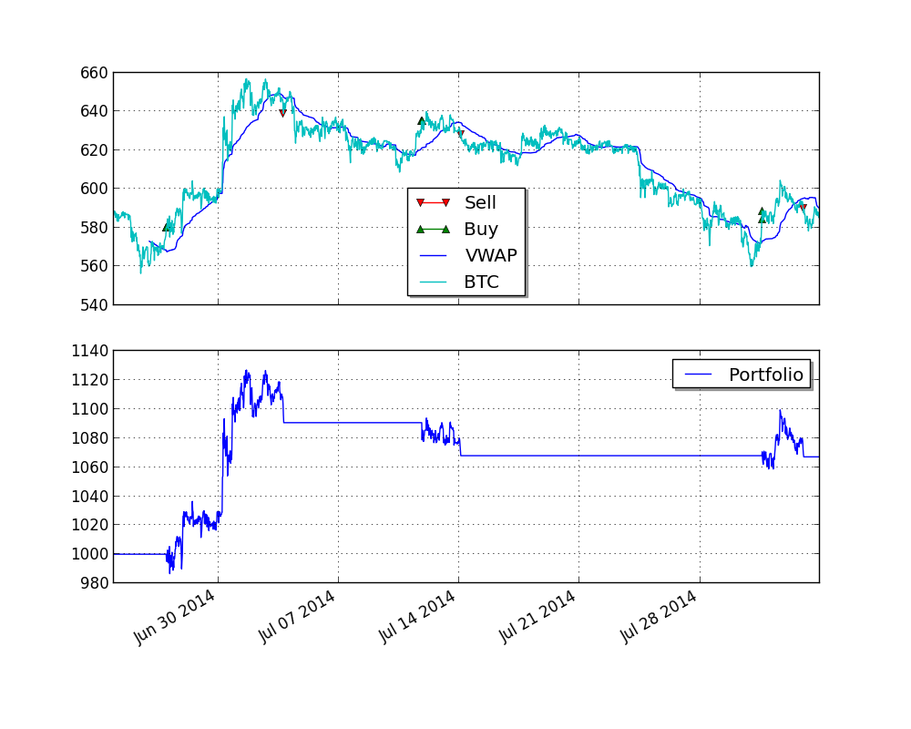

Bitcoin Charts example
======================

Although it is absolutely possible to backtest a strategy with tick data as supplied by
http://www.bitcoincharts.com/about/markets-api/ using :class:`pyalgotrade.bitcoincharts.barfeed.CSVTradeFeed`,
you may want to to backtest using summarized bars at a different frequency to make backtesting faster.

As of 12-Aug-2014, http://api.bitcoincharts.com/v1/csv/bitstampUSD.csv.gz has 4588830 events so we'll transform a portion of
it into 30 minute bars for backtesting purposes with the following script:

.. literalinclude:: ../samples/bccharts_example_1.py

It will take some time to execute, so be patient. The resampled file should look like this: ::

    Date Time,Open,High,Low,Close,Volume,Adj Close
    2014-01-01 00:00:00,732.0,738.25,729.01,734.81,266.17955488,
    2014-01-01 00:30:00,734.81,739.9,734.47,739.02,308.96802502,
    2014-01-01 01:00:00,739.02,739.97,737.65,738.11,65.66924473,
    2014-01-01 01:30:00,738.0,742.0,737.65,741.89,710.27165024,
    2014-01-01 02:00:00,741.89,757.99,741.89,752.23,1085.13335011,
    2014-01-01 02:30:00,752.23,755.0,747.0,747.2,272.03949342,
    2014-01-01 04:00:00,744.98,748.02,744.98,747.19,104.65989075,
    .
    .

We can now take advantage of :class:`pyalgotrade.barfeed.csvfeed.GenericBarFeed` to load the resampled file and backtest a
Bitcoin strategy. We'll be using a VWAP momentum strategy for illustration purposes:

.. literalinclude:: ../samples/bccharts_example_2.py

This is what the plot looks like:

