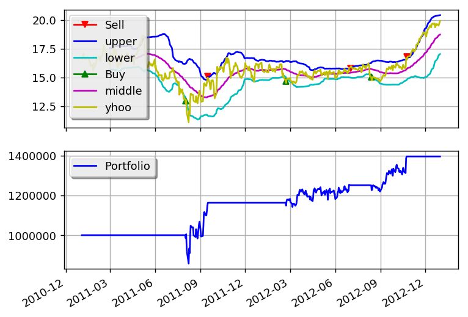

Bollinger Bands
===============

This example is based on:
 * http://www.investopedia.com/articles/trading/07/bollinger.asp

.. literalinclude:: ../samples/bbands.py

this is what the output should look like:

.. literalinclude:: ../samples/bbands.output

and this is what the plot should look like:

You can get better returns by tunning the Bollinger Bands period as well as the entry and exit points.
