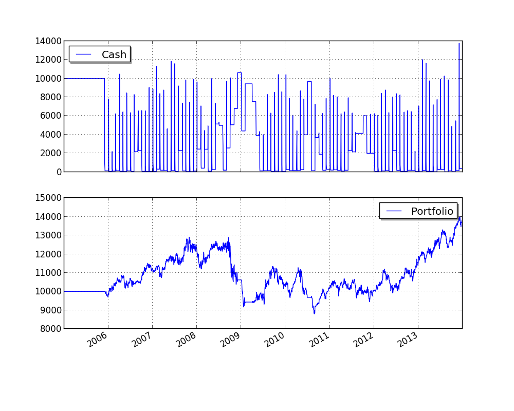

Market Timing Using Moving-Average Crossovers
=============================================

This example is inspired on the Market Timing / GTAA model described in:
 * http://mebfaber.com/timing-model/
 * http://papers.ssrn.com/sol3/papers.cfm?abstract_id=962461

The stragegy supports analyzing more than one instrument per asset class, and selects the one that has highest
returns in the last month.

.. literalinclude:: ../samples/market_timing.py

This is what the output should look like:

.. literalinclude:: ../samples/market_timing.output

This is what the plot should look like:

