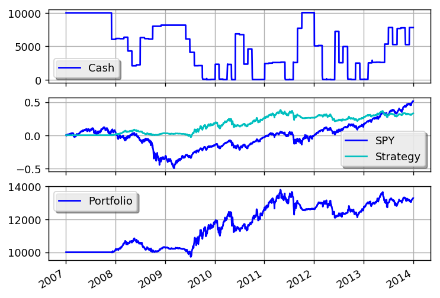

Market Timing Using Moving-Average Crossovers
=============================================

This example is based on:
 * http://www.investingdaily.com/18094/avoid-market-crashes-using-the-ivy-portfolio-market-timing-system/

.. literalinclude:: ../samples/market_timing.py

This is what the output should look like:

.. literalinclude:: ../samples/market_timing.output

This is what the plot should look like:

