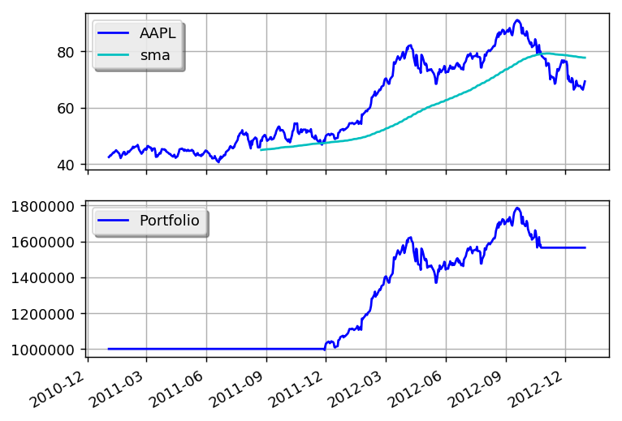

SMA Crossover
=============

Save this code as sma_crossover.py:

.. literalinclude:: ../samples/sma_crossover.py

and use the following code to execute the strategy:

.. literalinclude:: ../samples/sma_crossover_sample.py

This is what the output should look like:

.. literalinclude:: ../samples/sma_crossover.output

and this is what the plot should look like:

You can get better returns by tunning the sma period.
