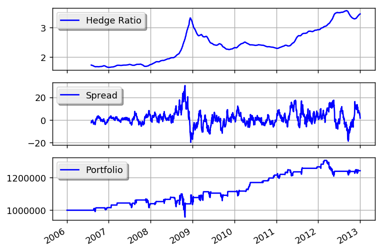

Ernie Chan's Gold vs. Gold Miners
=================================

This example is based on:
 * http://epchan.blogspot.com.ar/2006/11/gold-vs-gold-miners-another-arbitrage.html
 * https://www.quantopian.com/posts/ernie-chans-gold-vs-gold-miners-stat-arb

.. literalinclude:: ../samples/statarb_erniechan.py

this is what the output should look like:

.. literalinclude:: ../samples/statarb_erniechan.output

and this is what the plot should look like:

You can get better returns by tunning the window size as well as the entry and exit values for the z-score.

