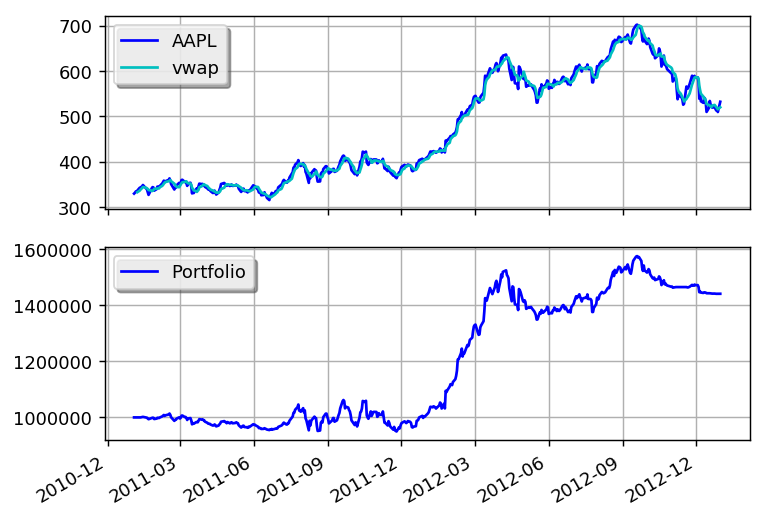

VWAP Momentum Trade
===================

This example is based on:
 * https://www.quantopian.com/posts/momentum-trade

.. literalinclude:: ../samples/vwap_momentum.py

this is what the output should look like:

.. literalinclude:: ../samples/vwap_momentum.output

and this is what the plot should look like:

You can get better returns by tunning the VWAP and threshold parameters.

