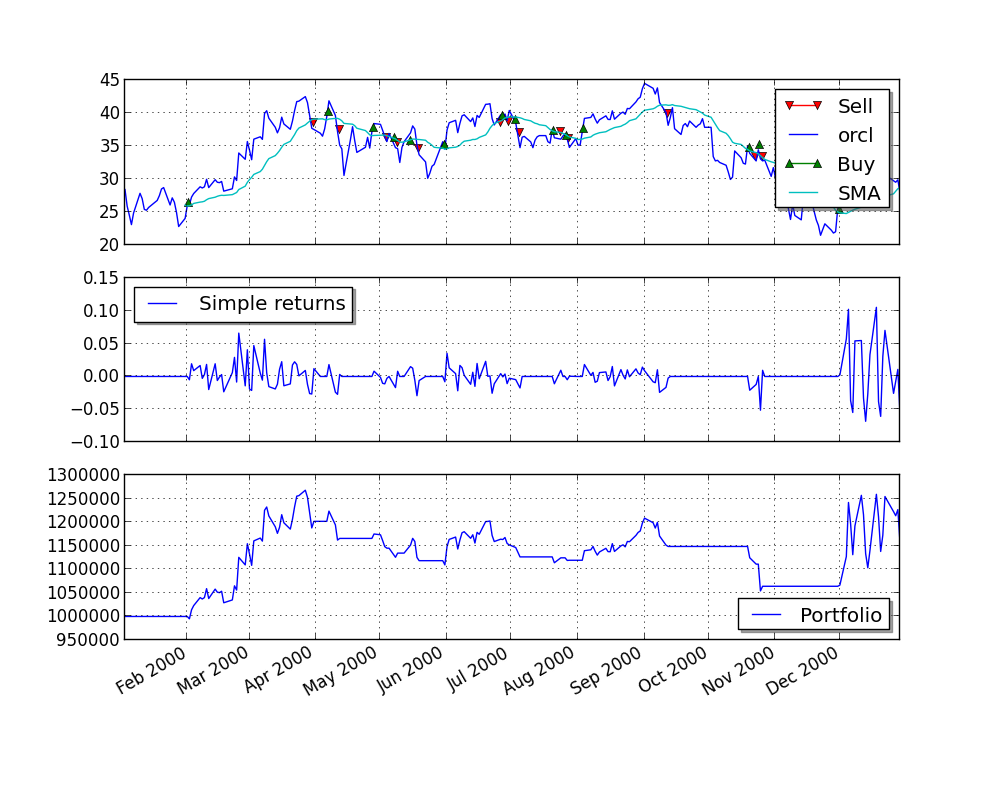

.. _tutorial-label:

Tutorial
========

The goal of this tutorial is to give you a quick introduction to PyAlgoTrade.
As described in the introduction, the goal of PyAlgoTrade is to help you backtest stock trading strategies.
Let's say you have an idea for a trading strategy and you'd like to evaluate it with historical data and see how it behaves,
then PyAlgoTrade should allow you to do so with minimal effort.

Before I move on I would like to thank Pablo Jorge who helped reviewing the initial design and documentation.

**This tutorial was developed on a UNIX environment, but the steps to adapt it to a Windows environment should be straightforward.**

PyAlgoTrade has 6 main components:

 * Strategies
 * Feeds
 * Brokers
 * DataSeries
 * Technicals
 * Optimizer

Strategies
    These are the classes that you define that implement the trading logic. When to buy, when to sell, etc.

Feeds
    These are data providing abstractions. For example, you'll use a CSV feed that loads bars from a CSV
    (Comma-separated values) formatted file to feed data to a strategy.
    Feeds are not limited to bars. For example, there is a Twitter feed that allows incorporating Twitter
    events into trading decisions.

Brokers
    Brokers are responsible for executing orders.

DataSeries
    A data series is an abstraction used to manage time series data.

Technicals
    These are a set of filters that you use to make calculations on top of DataSeries.
    For example SMA (Simple Moving Average), RSI (Relative Strength Index), etc. These filters are modeled as DataSeries decorators.

Optimizer
    These are a set of classes that allow you to distribute backtesting among different computers,
    or different processes running in the same computer, or a combination of both. They make horizontal scaling easy.

Having said all that, the first thing that we'll need to test our strategies is some data.
Let's use Oracle's stock prices for year 2000, which we'll download with the following command: ::

    python -c "from pyalgotrade.tools import yahoofinance; yahoofinance.download_daily_bars('orcl', 2000, 'orcl-2000.csv')"

The pyalgotrade.tools.yahoofinance package downloads CSV formatted data from Yahoo! Finance. 
The orcl-2000.csv file should look like this: ::

    Date,Open,High,Low,Close,Volume,Adj Close
    2000-12-29,30.87,31.31,28.69,29.06,31655500,28.35
    2000-12-28,30.56,31.12,30.37,31.06,25055600,30.30
    2000-12-27,30.37,31.06,29.37,30.69,26441700,29.94
    .
    .
    2000-01-04,115.50,118.62,105.00,107.69,116850000,26.26
    2000-01-03,124.62,125.19,111.62,118.12,98122000,28.81

Let's start with a simple strategy, that is, one that just prints closing prices as they are processed:

.. literalinclude:: ../samples/tutorial-1.py

The code is doing 3 main things:
 1. Declaring a new strategy. There is only one method that has to be defined, *onBars*, which is called for every bar in the feed.
 2. Loading the feed from a CSV file.
 3. Running the strategy with the bars supplied by the feed.

If you run the script you should see the closing prices in order:

.. literalinclude:: ../samples/tutorial-1.output

Let's move on with a strategy that prints closing SMA prices, to illustrate how technicals are used:

.. literalinclude:: ../samples/tutorial-2.py

This is very similar to the previous example, except that:

 1. We're initializing an SMA filter over the closing price data series.
 2. We're printing the current SMA value along with the closing price.

If you run the script you should see the closing prices and the corresponding SMA values, but in this case the first 14 SMA values are None.
That is because we need at least 15 values to get something out of the SMA:

.. literalinclude:: ../samples/tutorial-2.output

All the technicals will return None when the value can't be calculated at a given time.

One important thing about technicals is that they can be combined. That is because they're modeled as DataSeries as well.
For example, getting an SMA over the RSI over the closing prices is as simple as this:

.. literalinclude:: ../samples/tutorial-3.py

If you run the script you should see a bunch of values on the screen where:

 * The first 14 RSI values are None. That is because we need at least 15 values to get an RSI value.
 * The first 28 SMA values are None. That is because the first 14 RSI values are None, and the 15th one is the first not None value that the SMA filter receives.
   We can calculate the SMA(15) only when we have 15 not None values .

.. literalinclude:: ../samples/tutorial-3.output

Trading
-------

Let's move on with a simple strategy, this time simulating actual trading. The idea is very simple:

 * If the adjusted close price is above the SMA(15) we enter a long position (we place a buy market order).
 * If a long position is in place, and the adjusted close price drops below the SMA(15) we exit the long position (we place a sell market order).

.. literalinclude:: ../samples/tutorial-4.py

If you run the script you should see something like this: 

.. literalinclude:: ../samples/tutorial-4.output

But what if we used 30 as the SMA period instead of 15 ? Would that yield better results or worse ?
We could certainly do something like this:

::

    for i in range(10, 30):
        run_strategy(i)

and we would find out that we can get better results with a SMA(20): ::

    Final portfolio value: $1075.38

This is ok if we only have to try a limited set of parameters values. But if we have to test a strategy with multiple
parameters, then the serial approach is definitely not going to scale as strategies get more complex.

Optimizing
----------

Meet the optimizer component. The idea is very simple:

 * There is one server responsible for:
    * Providing the bars to run the strategy.
    * Providing the parameters to run the strategy.
    * Recording the strategy results from each of the workers.
 * There are multiple workers responsible for:
    * Running the strategy with the bars and parameters provided by the server.

To illustrate this we'll use a strategy known as RSI2 (http://stockcharts.com/school/doku.php?id=chart_school:trading_strategies:rsi2)
which requires the following parameters:

 * An SMA period for trend identification. We'll call this entrySMA and will range between 150 and 250.
 * A smaller SMA period for the exit point. We'll call this exitSMA and will range between 5 and 15.
 * An RSI period for entering both short/long positions. We'll call this rsiPeriod and will range between 2 and 10.
 * An RSI oversold threshold for long position entry. We'll call this overSoldThreshold and will range between 5 and 25.
 * An RSI overbought threshold for short position entry. We'll call this overBoughtThreshold and will range between 75 and 95.

If my math is ok, those are 4409559 different combinations.

Testing this strategy for one set of parameters took me about 0.16 seconds. If I execute all the combinations serially
it'll take me about 8.5 days to evaluate all of them and find the best set of parameters. That is a long time, but
if I can get ten 8-core computers to do the job then the total time will go down to about 2.5 hours.

Long story short, **we need to go parallel**.

Let's start by downloading 3 years of daily bars for 'Dow Jones Industrial Average': ::

    python -c "from pyalgotrade.tools import yahoofinance; yahoofinance.download_daily_bars('dia', 2009, 'dia-2009.csv')"
    python -c "from pyalgotrade.tools import yahoofinance; yahoofinance.download_daily_bars('dia', 2010, 'dia-2010.csv')" 
    python -c "from pyalgotrade.tools import yahoofinance; yahoofinance.download_daily_bars('dia', 2011, 'dia-2011.csv')"

Save this code as rsi2.py:

.. literalinclude:: ../samples/rsi2.py

This is the server script:

.. literalinclude:: ../samples/tutorial-optimizer-server.py

The server code is doing 3 things:

 1. Declaring a generator function that yields different parameter combinations for the strategy.
 2. Loading the feed with the CSV files we downloaded.
 3. Running the server that will wait for incoming connections on port 5000.

This is the worker script that uses the **pyalgotrade.optimizer.worker** module to run the strategy in parallel with
the data supplied by the server:

.. literalinclude:: ../samples/tutorial-optimizer-worker.py

When you run the server and the client/s you'll see something like this on the server console: ::

    2014-05-03 15:04:01,083 server [INFO] Loading bars
    2014-05-03 15:04:01,348 server [INFO] Waiting for workers
    2014-05-03 15:04:58,277 server [INFO] Partial result 1242173.28754 with parameters: ('dia', 150, 5, 2, 91, 19) from localworker
    2014-05-03 15:04:58,566 server [INFO] Partial result 1203266.33502 with parameters: ('dia', 150, 5, 2, 81, 19) from localworker
    2014-05-03 15:05:50,965 server [INFO] Partial result 1220763.1579 with parameters: ('dia', 150, 5, 3, 83, 24) from localworker
    2014-05-03 15:05:51,325 server [INFO] Partial result 1221627.50793 with parameters: ('dia', 150, 5, 3, 80, 24) from localworker
    .
    .

and something like this on the worker/s console: ::

    2014-05-03 15:02:25,360 localworker [INFO] Running strategy with parameters ('dia', 150, 5, 2, 84, 15)
    2014-05-03 15:02:25,377 localworker [INFO] Running strategy with parameters ('dia', 150, 5, 2, 94, 5)
    2014-05-03 15:02:25,661 localworker [INFO] Result 1090481.06342
    2014-05-03 15:02:25,661 localworker [INFO] Result 1031470.23717
    2014-05-03 15:02:25,662 localworker [INFO] Running strategy with parameters ('dia', 150, 5, 2, 93, 25)
    2014-05-03 15:02:25,665 localworker [INFO] Running strategy with parameters ('dia', 150, 5, 2, 84, 14)
    2014-05-03 15:02:25,995 localworker [INFO] Result 1135558.55667
    2014-05-03 15:02:25,996 localworker [INFO] Running strategy with parameters ('dia', 150, 5, 2, 93, 24)
    2014-05-03 15:02:26,006 localworker [INFO] Result 1083987.18174
    2014-05-03 15:02:26,007 localworker [INFO] Running strategy with parameters ('dia', 150, 5, 2, 84, 13)
    2014-05-03 15:02:26,256 localworker [INFO] Result 1093736.17175
    2014-05-03 15:02:26,257 localworker [INFO] Running strategy with parameters ('dia', 150, 5, 2, 84, 12)
    2014-05-03 15:02:26,280 localworker [INFO] Result 1135558.55667
    .
    .

Note that you should run **only one server and one or more workers**.

If you just want to run strategies in parallel in your own desktop you can take advantage of the **pyalgotrade.optimizer.local**
module like this:

.. literalinclude:: ../samples/tutorial-optimizer-local.py

The code is doing 3 things:

 1. Declaring a generator function that yields different parameter combinations.
 2. Loading the feed with the CSV files we downloaded.
 3. Using the **pyalgotrade.optimizer.local** module to run the strategy in parallel and find the best result.

When you run this code you should see something like this: ::

    2014-05-03 15:08:06,587 server [INFO] Loading bars
    2014-05-03 15:08:06,910 server [INFO] Waiting for workers
    2014-05-03 15:08:58,347 server [INFO] Partial result 1242173.28754 with parameters: ('dia', 150, 5, 2, 91, 19) from worker-95583
    2014-05-03 15:08:58,967 server [INFO] Partial result 1203266.33502 with parameters: ('dia', 150, 5, 2, 81, 19) from worker-95584
    2014-05-03 15:09:52,097 server [INFO] Partial result 1220763.1579 with parameters: ('dia', 150, 5, 3, 83, 24) from worker-95584
    2014-05-03 15:09:52,921 server [INFO] Partial result 1221627.50793 with parameters: ('dia', 150, 5, 3, 80, 24) from worker-95583
    2014-05-03 15:10:40,826 server [INFO] Partial result 1142162.23912 with parameters: ('dia', 150, 5, 4, 76, 17) from worker-95584
    2014-05-03 15:10:41,318 server [INFO] Partial result 1107487.03214 with parameters: ('dia', 150, 5, 4, 83, 17) from worker-95583
    .
    .

For the record, the best result found was $2314.40 with the following parameters:
 1. entrySMA: 154
 2. exitSMA: 5
 3. rsiPeriod: 2
 4. overBoughtThreshold: 91
 5. overSoldThreshold: 18

Plotting
--------

PyAlgoTrade makes it very easy to plot a strategy execution.

Save this as sma_crossover.py:

.. literalinclude:: ../samples/sma_crossover.py

and save this code to a different file:

.. literalinclude:: ../samples/tutorial-5.py

The code is doing 3 things:

 1. Loading the feed from a CSV file.
 2. Running the strategy with the bars supplied by the feed and a StrategyPlotter attached.
 3. Plotting the strategy.

This is what the plot looks like:

I hope you enjoyed this quick introduction. I'd recommend you to download PyAlgoTrade here: http://gbeced.github.io/pyalgotrade/downloads/index.html 
and get started writing you own strategies.

You can also find more examples in the :ref:`samples-label` section.
